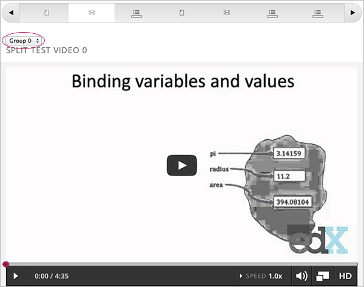
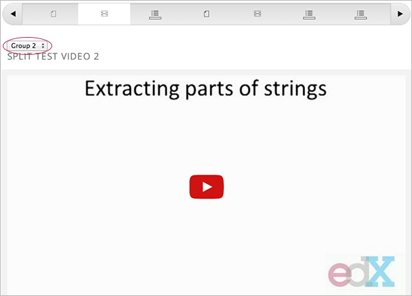
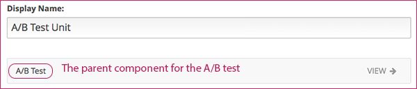

.. _Setting Up A/B Tests:

###############################
Setting Up A/B Tests
###############################

This chapter describes how you can use A/B tests in your course. See:

* :ref:`Overview of A/B Tests`
* :ref:`The Course Staff View of A/B Tests`
* :ref:`The Studio Outline View of A/B Tests`
* :ref:`Configure the A/B Test Policy`
* :ref:`Configure the A/B Test in XML`

.. _Overview of A/B Tests:

***********************************
Overview of A/B Tests
***********************************

With A/B test functionality, you can create experiments that show different course content to different groups of students. 

You can run multiple experiments in your course, and each experiment
can contain any number of groups.

Students are randomly assigned to content groups. You cannot control which
students are assigned to which group.

You determine which components are for which groups.

You can research and compare the performance of students in groups to gain more
insight into the relative effectiveness of your course content.

.. note:: In the current release, you must configure A/B tests through XML, then import the XML course into edX Studio. You can view and edit A/B tests in Studio, but you cannot create the content of A/B tests directly. See :ref:`Import a Course` for instructions.

.. _The Course Staff View of A/B Tests:

***********************************
The Course Staff View of A/B Tests
***********************************

When you view a unit that contains an A/B test in the LMS in the Staff view, you
use a drop-down list to select a group. The unit page then shows the content for
that group of students.

For example, in the following page, Group 0 is selected, and the video component that is configured to show for Group 0 is displayed:

You can change the group selection to view the video that a different group of students sees:

.. note:: The example course content in this chapter uses A/B test terminology to make the functionality clear. Typically, you do not want to use terminology in course content that would make students aware of the experiment.

.. _The Studio Outline View of A/B Tests:

********************************************
The Studio Outline View of A/B Tests
********************************************

After you configure an A/B test in XML and import the course into Studio, you can view the A/B test in the course outline.

The A/B test is displayed in a unit page as a component that contains other components. See :ref:`Nested Components` for more information.

If the unit containing the A/B test is private or in draft, you can edit components in the A/B test just as you can any other component. See :ref:`Components` for more information.

The A/B test as a whole is the parent component.

For example, the following unit page contains just one component, which is the A/B test. No other content is shown on the unit page.

You see the A/B test's child components by clicking the arrow in the link above.  A read-only page then shows all the components in the A/B test:

.. image:: ../Images/a_b_test_children.png
 :alt: Image of the A/B test child components

Click the arrow next to a test component name to expand that test to see its contents. In this example, Group A contains an HTML component and a video:

.. image:: ../Images/a_b_test_child_expanded.png
 :alt: Image of an expanded A/B test component

.. _Configure the A/B Test Policy:

******************************
Configure the A/B Test Policy
******************************

To configure an A/B test in your course, you start by defining the test policy.

You set the test policy in the ``policy.json`` file in the ``policies`` directory.

See :ref:`Define the A/B Test Content in the Split Test File` for more information on how the XML for the A/B test uses these settings.

++++++++++++++++++++++++++++++++++++
Example of a Simply A/B Test Policy
++++++++++++++++++++++++++++++++++++

The following is an example JSON object that defines an experiment, or A/B test, with two groups.

.. code-block:: json

    "user_partitions": [{"id": 0,
                       "name": "Name of the Experiment",
                       "description": "Description of the experiment.",
                       "version": 1,
                       "groups": [{"id": 0,
                                   "name": "Group A",
                                   "version": 1},
                                  {"id": 1,
                                   "name": "Group B",
                                   "version": 1}]}]

In this example:

* The ``"id": 0`` identifies the experiment. The value is referenced in ``user_partition`` attribute of the ``<split_test>`` element in the for A/B test file.  You can configure multiple experiments in your course, with each experiment having its own, independent groups.

* The ``groups`` definition identifies the groups to which students are randomly assigned. Each group ``id`` value is referenced in the ``group_id_to_child`` attribute of the ``<split_test>`` element.

++++++++++++++++++++++++++++++++++++++++++
Example of a More Complex A/B Test Policy
++++++++++++++++++++++++++++++++++++++++++

The following is an example JSON object that defines two experiments, the first with two groups, the second with three groups.

.. code-block:: json

    "user_partitions": [{"id": 0,
                         "name": "Name of Experiment 1",
                         "description": "Description of Experiment 1.",
                         "version": 1,
                         "groups": [{"id": 0,
                                     "name": "Group A",
                                     "version": 1},
                                    {"id": 1,
                                     "name": "Group B",
                                     "version": 1}]}
                        {"id": 1,
                         "name": "Name of Experiment 2",
                         "description": "Description of Experiment 2.",
                         "version": 1,
                         "groups": [{"id": 2,
                                     "name": "Group C",
                                     "version": 1},
                                    {"id": 3,
                                     "name": "Group D",
                                     "version": 1}]}]

++++++++++++++++++++++++++++++++++++++++++
Modifying the A/B Test Policy
++++++++++++++++++++++++++++++++++++++++++

After a course has started, you may find that students in a specific group are having a problem or poor experience. In this situation, you can remove the group from the experiment in the policy file.

Students in the removed group are reassigned to another group. Those students will lose any progress they made on graded problems that were part of the experiment for that group.

Removing a group impacts the course event data. Ensure that researchers evaluating your course results are aware of the group you removed and the date.

.. warning:: Do not change the ``id`` value of experiments or groups after a course starts.

.. _Configure the A/B Test in XML:

******************************
Configure the A/B Test in XML
******************************

You work with multiple XML files to configure an A/B test in your course. This section steps through the files involved in an A/B test that shows different content to two different groups of students.

For information about XML courses, see the `edX XML Tutorial <http://edx.readthedocs.org/projects/devdata/en/latest/course_data_formats/course_xml.html>`_.

++++++++++++++++++++++++++++++++++++++++++++++
Define the A/B Test in the Sequential File
++++++++++++++++++++++++++++++++++++++++++++++

You reference an A/B test in the file for the subsection in the ``sequential`` directory. For example:

.. code-block:: xml

    .....
    <vertical url_name="name for the unit that contains the A/B test" display_name="A/B Test Unit">
        <split_test url_name="name of A/B test file in the split_test folder"/>
    </vertical>
    .....

The ``<split_test>`` element's ``url_name`` value references the name of the A/B test file in the ``split_test`` directory.

.. _Define the A/B Test Content in the Split Test File:

++++++++++++++++++++++++++++++++++++++++++++++++++++++
Define the A/B Test Content in the Split Test File
++++++++++++++++++++++++++++++++++++++++++++++++++++++

After you define the A/B test in the sequential file, you define the course content you want to test in the file in the ``split_test`` directory. This is the file referenced in the ``<split_test>`` element in the sequential file, as shown above.

In the A/B test file, you add elements for the A/B test content. For this example, you add two elements to compare the two different video files.

.. code-block:: xml

    <split_test url_name="AB_Test.xml" display_name="A/B Test" user_partition_id="0" 
                group_id_to_child='{"0": "i4x://path-to-course/vertical/group_a", 
                                    "1": "i4x://path-to-course/vertical/group_b"}'>
        <vertical url_name="group_a" display_name="Group A">
           <html>Welcome to group A.</html>
           <video url_name="group_a_video"/>
        </vertical>
        <vertical url_name="group_b" display_name="Group B">
            <html>Welcome to group B.</html>
            <problem display_name="Checkboxes">
                
A checkboxes problem presents checkbox buttons for student input. 
                   Students can select more than one option presented.

                <choiceresponse>
                    <checkboxgroup direction="vertical" label="Select the answer that matches">
                        <choice correct="true">correct</choice>
                        <choice correct="false">incorrect</choice>
                        <choice correct="true">correct</choice>
                    </checkboxgroup>
                </choiceresponse>
            </problem>
        </vertical>
    </split_test>

In this example:

* The ``user_partition_id`` value references the ID of the experiment defined in the ``policy.json`` file. 

* The ``group_id_to_child`` value references the IDs of the groups defined in the ``policy.json`` file, and maps the group IDs to specific content.

  For example,  the value for group ``0``, ``i4x://path-to-course/vertical/group_a`` maps to the ``<vertical>`` element with the ``url_name`` equal to ``group_a``.  Therefore, students in group 0 see the content in that vertical.

For information about the ``policy.json`` file, see :ref:`Configure the A/B Test Policy`.
