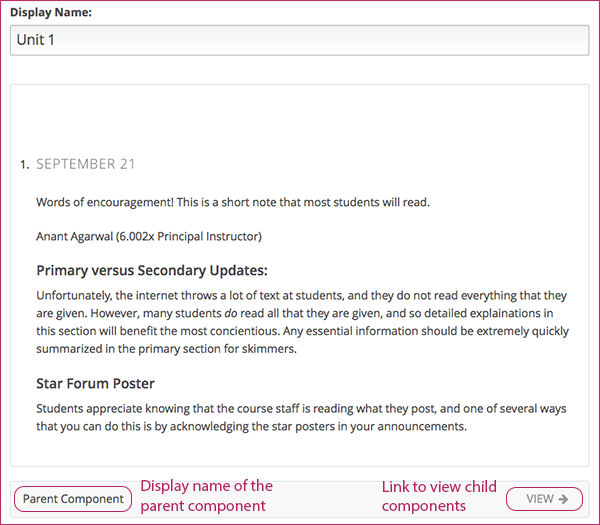
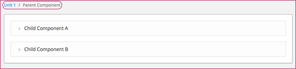
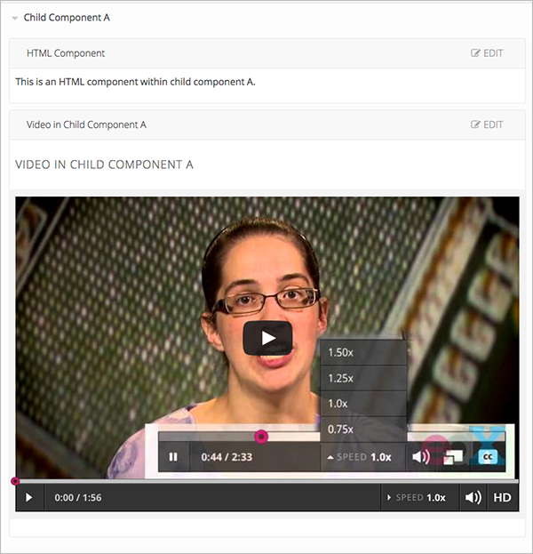

.. _Organizing Your Course Content:

###############################
Organizing Your Course Content
###############################

.. _How a Course is Organized:

*************************
How a Course is Organized
*************************

You organize your course in the following hierarchy:

* :ref:`Sections`, which contain
* :ref:`subsections`, which contain
* :ref:`units`, which contain
* :ref:`components`, which contain your actual course content.

Studio provides you with flexibility when organizing your course. A common
course model is for sections to correspond to weeks or chapters, and for
subsections to correspond to lessons.

.. note::  We recommend that you review :ref:`Guidelines for Creating Accessible
 Content` before developing content for your course.

==================
The Course Outline
==================

In Studio, you view your course organization through the course outline.

To open the course outline, on the **Content** menu, click **Outline**.

The following image shows the different elements of a course outline:

.. image:: ../Images/Course_Outline.png
 :alt: Image of the course outline, with call-outs for sections, subsection, and
     units

The following image shows the way this course content appears in the LMS:

.. image:: ../Images/Course_Outline_LMS.png
  :alt: Image of sections from the student's point of view

.. _Sections:

********
Sections
********

A section is the topmost category in your course. A section can represent a time
period in your course, a chapter, or another organizing principle. A section
contains one or more subsections.

To create a section:

#. In the course outline, click **New Section**.
#. In the field that opens at the top of the outline, enter the new section
   name.
#. Click **Save**.

The new, empty section appears at the bottom of the course outline.
You can now add subsections to the section.

Whether or not students see the new section depends on the release date.

See :ref:`Publishing Your Course` for more information.

.. _Subsections:

****************
Subsections
****************

Sections are divided into subsections, which in turn contain one or more units.
A subsection may represent a topic in your course, or another organizing
principle. Subsections are sometimes called "lessons" or "learning sequences."

To create a subsection:

#. On the **Course Outline** page, under the name of the section that you want,
   click **New Subsection**.
#. In the field that opens at the bottom of the section, enter the new
   subsection name.
#. Click **Save**.

The new, empty subsection appears at the bottom of the section. You can then add
units to the subsection.

==================
Edit a Subsection
==================

You add and delete subsections from the **Course Outline** page. You edit a
subsection's settings on the page for that subsection. To open the page for a
subsection, click the name of the subsection on the **Course Outline** page.

On the page for the subsection, you can see all the units in the subsection.

.. image:: ../Images/subsection.png
 :alt: Image of the subsection page

You can also do the following.

- Change the subsection name
- Add or delete a unit
- Set the subsection release date and time
- Set the subsection to be an assignment type
- Set a due date for the exercises in the subsection (if you set the assignment
  type of the subsection)
- Preview a draft of the subsection
- View the live version of your course 

Whether students can see a subsection depends on its release date. For more
information, see :ref:`Publishing Your Course`.

For more information about setting assignment types, see :ref:`Establish a
Grading Policy`.

For more information about viewing drafts or the current version of your course,
see :ref:`Preview Your Course` and :ref:`View Your Live Course`.

.. _Units:

******
Units
******

Subsections are divided into units. A unit, in turn, contains one or more
components, such as HTML content, problems, and videos.

In the LMS, each unit in the subsection appears as a link on the course ribbon
at the top of the page. The following image shows a subsection that has eight
units:

.. image:: ../Images/Units_LMS.png
 :alt: Image of units from a student's point of view

The titles in the pop-up dialog, in white text on a black background, are the
display names of the components in that unit.

You can create a unit from the course outline or the subsection page. To create
a unit, click **New Unit** within the subsection that you want.

When you create a new unit, a page opens for that unit. On the unit page, you
can do the following.

- Enter the unit name that you want in the **Display Name** field. Note that
  students do not see the unit name.
- Create components in the unit.
- Change the visibility of the unit. By default, the unit visibility is set to
  **Private**, so students will not be able to see the unit.Unless you want
  students to see the unit immediately, leave this setting as-is. For more
  information, see :ref:`Publishing Your Course`.
- Preview a draft of the unit.
- If a unit has been published, view the live version of the unit.

After you create a new unit, you can create components in the unit.

.. warning::

  Studio does not have versioning and does not automatically update your browser
  between refreshes. Versioning is planned for future releases, but, in the
  meantime, only one author should edit a unit, in one browser, on only one tab.
  If a unit is open for editing in multiple browser sessions, the session that
  saves last will overwrite any previously saved content without displaying a
  warning. Also, older browser sessions can overwrite more recent content, so
  you should refresh your browser before you start working every time you work
  with a private unit or edit a draft of a public unit.

.. _Components:

**********
Components
**********

A component is the part of a unit that contains your actual course content. A
unit can contain one or more components.

A student can view the name of all components in a unit by hovering over the
unit in the ribbon at the top of the page.

.. image:: ../Images/ComponentNames_CourseRibbon.png
 :alt: Image of the component list for a unit

By default, Studio includes four types of components.

- **Discussion components** provide discussion spaces in the body of your
  course. Students can explore ideas about a lesson with their peers in a
  discussion space.
- **HTML components** allow you to add text, images, and some types of learning
  tools to your course. Content in HTML components is formatted as HTML.
- **Problem components** enable you to add many different types of exercises and
  problems to you course, from simple multiple choice problems to complex
  circuit schematic exercises.
- **Video components** contain the videos that you want to include in your course. 

To add a component to the unit, click the component type that you want under
**Add New Component**.

.. image:: ../Images/AddNewComponent.png
  :alt: Image of adding a new component

For more information, see the documentation for the specific component type that
you want:

- :ref:`Working with Discussion Components`
- :ref:`Working with HTML Components`
- :ref:`Working with Problem Components`
- :ref:`Working with Video Components`

==================
Edit a Component
==================

You can edit a component only if the unit that contains it is Private, or if you
are editing a new draft of the unit. For more information, see :ref:`Public and
Private Units`.

When you can edit the component, the Edit icon and the Display Name appear in
the component header:

.. image:: ../Images/unit-edit.png
  :alt: Image of a unit with Edit icon circled

Click the Edit icon.  Then follow instructions for the type of component you are
editing.

=====================================
Set the Display Name for a Component
=====================================

Each component has a display name that shows in the component header when you
can edit the component. The display name also shows to students when they hover
the mouse pointer over the unit icon in the course accordian.

To set the display name for a component:

#. Edit the component.
#. Click **Settings**.
#. Edit the **Display Name** field.

  .. image:: ../Images/display-name.png
   :alt: Image of the Display Name field for a component.

4. Click **Save**.

Different types of components have different fields in the Settings dialog box,
but all have the **Display Name** field.

======================
Duplicate a Component
======================

You can duplicate a component only if the unit that contains it is Private, or
if you are editing a new draft of the unit. For more information, see
:ref:`Public and Private Units`.

When you duplicate a component, a new copy of that component is added directly
beneath the first component. You can then modify the duplicate. In many cases,
duplicating a component and editing a copy is a faster way to create new
content.

When you can duplicate the component, the Duplicate icon appears in the
component header:

.. image:: ../Images/unit-dup.png
  :alt: Image of a unit with Duplicate icon circled

Click the Duplicate icon.  Then follow instructions for the type of component
you are editing.

======================
Delete a Component
======================

You can delete a component only if the unit that contains it is Private, or if
you are editing a new draft of the unit. For more information, see :ref:`Public
and Private Units`.

.. note:: Be sure you want to delete the component. You can not undo the
 deletion.

When you can delete the component, the Delete icon appears in the component
header:

.. image:: ../Images/unit-delete.png
  :alt: Image of a unit with Delete icon circled

Click the Delete icon.  Then follow instructions for the type of component you
are editing.

.. _Nested Components:

******************************************
Components that Contain Other Components
******************************************

You can configure your course content so that components contain other components.  Some examples of when you would need to do this is for conditional content or A/B tests.  See :ref:`Setting Up A/B Tests` for more information.

The component that contains other components is referred to as the parent; the contained components are referred to as children.  

In the unit page, a parent component appears with the display name and a **VIEW** link. For example:

When you click **VIEW**, the parent component page opens, showing all child components.  Breadcrumbs at the top of the page show the unit and parent component:

Click the arrow next to a child component name to expand that component to see its contents. In this example, Child Component A contains an HTML component and a video:

.. note:: In this release, you cannot create parent and child components in Studio. You set up components and their relationships to each other in XML. You can then import the course into Studio, edit the child components, and verify that your course components are organized as you intended.

If the unit containing the child components is private or in draft, you can edit the child components just as you can any other component.

======================================
XML for Parent and Child Components
======================================

You develop parent and child components in XML, then import the XML course into Studio to verify that the structure is as you intended. The following examples show the XML used to create the unit and components shown in Studio above.

The XML for the unit is:

.. code-block:: xml

    <vertical display_name="Unit 1">
        <html url_name="6a5cf0ea41a54b209e0815147896d1b2"/>
        <vertical url_name="131a499ddaa3474194c1aa2eced34455"/>
    </vertical>

The ``<vertical url_name="131a499ddaa3474194c1aa2eced34455"/>`` element above references the parent component file that contains the child components:
 
.. code-block:: xml

    <vertical display_name="Parent Component">
        <vertical url_name="2758bbc495dd40d59050da15b40bd9a5"/>
        <vertical url_name="c5c8b27c2c5546e784432f3b2b6cf2ea"/>
    </vertical>

The two verticals referenced by the parent component refer to the child components, which contain the actual content of your course:

.. code-block:: xml

    <vertical display_name="Child Component A">
        <html url_name="4471618afafb45bfb86cbe511973e225"/>
        <video url_name="fbd800d0bdbd4cb69ac70c47c9f699e1"/>
    </vertical>

.. code-block:: xml

    <vertical display_name="Child Component B">
        <html url_name="dd6ef295fda74a639842e1a49c66b2c7"/>
        <problem url_name="b40ecbe4ed1b4280ae93e2a158edae6f"/>
    </vertical>

Theoretically, there is no limit to the levels of component nesting you can use in your course.

======================================
The Student View of Nested Components
======================================

For students, all parent and child components are displayed on the unit page. The following example shows the student view of the unit described above:

TO REPLACE WHEN WORKING IN LMS

.. image:: ../Images/nested_components_student_view.png
 :alt: Image of the student's view of nested components

.. note:: The visibility of nested components depends on the visibility of the parent unit. The parent unit must be public for students to see nested components. For more information, see :ref:`Visibility of Components Contained by Other Components`.

.. _Reorganize Your Course:

**********************
Reorganize Your Course
**********************

You can reorganize your course by dragging and dropping sections, subsections,
units, and components. You can move elements on the **Course Outline** page or
on an individual unit page.

To move an element, hover over the element handle on the right side of the
screen until the mouse pointer changes to a four-headed arrow. Then, click and
drag the element to the location that you want.

.. image:: ../Images/DragAndDropExample.png
 :alt: Image of the course outline, with the handle for a unit selected for drag
     and drop

When you move an element, a blue line indicates where the element will land when
you release the mouse.

.. image:: ../Images/DragAndDrop_BlueLine.png
 :alt: Image of the course outline, with a unit being dragged to a different
     location
