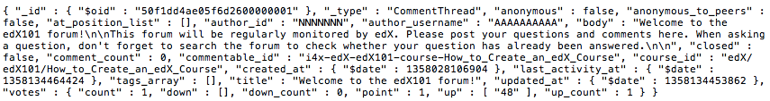
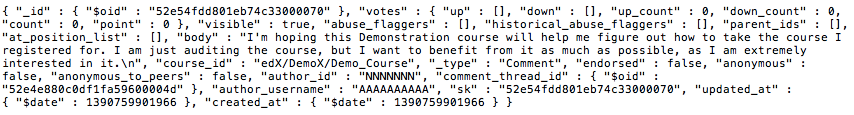

######################
Discussion Forums Data
######################

Data for the discussions in edX is stored in a MongoDB database as collections of JSON documents. MongoDB is a document-oriented, NoSQL database system. MongoDB is open source; documentation can be found at docs.mongodb.org/manual/.

In the data package, discussion data is delivered in a MONGO file, identified by organization and course, in this format: edX-*organization*-*course*-*source*.mongo. 

The primary collection that holds all of the discussion posts written by users is contents. Two different types of objects are stored, representing the three levels of interactions that users can have in a discussion. 

* A CommentThread represents the first level of interaction: a post that opens a new thread, often a student question of some sort. 

* A Comment represents both the second and third levels of interaction: a response made directly to the conversation started by a CommentThread is a Comment, and any further contribution made to a response is also a Comment.

A sample of the field/value pairs that are in the mongo file, and descriptions of the attributes that these two types of objects share and that are specific to each type, follow.

*********
Samples
*********

Two sample rows, or documents, from a mongo file of discussion data follow. 

CommentThread Document Example
----------------------------------------

Comment Document Example
----------------------------------------

*****************
Shared Fields
*****************

Descriptions of the fields that are present for both CommentThread and Comment objects follow.

`_id`
-----
  The 12-byte MongoDB unique ID for this collection. Like all MongoDB IDs, the IDs are monotonically increasing and the first four bytes are a timestamp. 

`_type`
-------
  CommentThread or Comment depending on the type of object.

`anonymous`
-----------
  If true, this CommentThread or Comment displays in the user interface as written by "anonymous", even to those who have moderator privileges in the forums.

`anonymous_to_peers`
--------------------
  Not used. The idea behind this field was that ``anonymous_to_peers = true`` would make the comment appear anonymous to other students, but would allow the course staff to see who you were. However, the feature was never implemented in the user interface, and only the ``anonymous`` field is actually used. The ``anonymous_to_peers`` field is always false.

`at_position_list`
------------------
  No longer used. Child comments (replies) are sorted by their ``created_at`` timestamp only. 

`author_id`
-----------
  Identifies the user who wrote this. Corresponds to the user IDs we store in our MySQL database as ``auth_user.id``.

`author_username`
------------------
  The username of the person who wrote the discussion post or comment. 

`body`
------
  Text of the comment in Markdown. UTF-8 encoded.

`course_id`
-----------
  The full course_id of the course that this comment was made in, including org and run. This value can be seen in the URL when browsing the courseware section. Example: ``BerkeleyX/Stat2.1x/2013_Spring``.

`created_at`
------------
  Timestamp in UTC. Example: ``ISODate("2013-02-21T03:03:04.587Z")``.

`updated_at`
------------
  Timestamp in UTC. Example: ``ISODate("2013-02-21T03:03:04.587Z")``.

`votes`
-------
  Both CommentThread and Comment objects support voting. In the user interface, students can vote for posts (CommentThreads) and for responses, but not for the third-level comments made on responses. All Comment objects still have this attribute, even though there is no way to actually vote on the comment-level items in the UI. This attribute is a dictionary that has the following items inside:

  * `up` = list of User IDs that up-voted this comment or thread.
  * `down` = list of User IDs that down-voted this comment or thread (no longer used).
  * `up_count` = total upvotes received.
  * `down_count` = total downvotes received (no longer used).
  * `count` = total votes cast.
  * `point` = net vote, now always equal to `up_count`.

A user only has one vote per Comment or CommentThread. Though it's still written to the database, the UI no longer displays an option to downvote anything.

**************************
CommentThread Fields
**************************

The following fields are specific to CommentThread objects. Each thread in the forums is represented by one CommentThread.

`closed`
--------
  If true, this thread was closed by a discussion forum moderator or admin.

`comment_count`
---------------
  The number of comment replies in this thread. This includes all responses and replies, but does not include the original comment that started the thread. So if we had::

    CommentThread: "What's a good breakfast?"
      * Comment: "Just eat cereal!"
      * Comment: "Try a Loco Moco, it's amazing!"
        * Comment: "A Loco Moco? Only if you want a heart attack!"
        * Comment: "But it's worth it! Just get a spam musubi on the side."

  In that exchange, the ``comment_count`` for this CommentThread is **4**.

`commentable_id`
----------------
  We can attach a discussion to any piece of content in the course, or to top level categories like "General" and "Troubleshooting". When the ``commentable_id`` is a high level category, it is specified in the course's policy file. When the ``commentable_id`` is a specific content piece (such as ``600x_l5_p8``, meaning course 6.00x, Lecture Sequence 5, Problem 8), it is taken from a discussion module in the course.

`last_activity_at`
------------------
  Timestamp in UTC indicating the last time there was activity in the thread (new posts, edits, etc). Closing the thread does not affect the value in this field. 

`tags_array`
------------
  No longer used. Intended to be a list of user definable tags.

`title`
-------
  Title of the thread. UTF-8 string.

********************
Comment Fields
********************

The following fields are specific to Comment objects. A Comment is a response to a CommentThread (so an answer to the question), or a reply to another Comment (a comment about somebody's answer). It used to be the case that Comment replies could nest much more deeply, but we later capped it at just these three levels (question, answer, comment) much in the way that StackOverflow does.

`visible`
----------
  Not used.

`abuse_flaggers`
--------------------
  Records the user id of each user who selects the **Report Misuse** flag for a Comment in the user interface. Stores an array of user ids if more than one user flags the Comment. Empty if no users flag the Comment. 

`historical_abuse_flaggers`
------------------------------
  If a discussion moderator removes the **Report Misuse** flag from a Comment, all user IDs in the ``abuse_flaggers`` field are removed and then written to this field.

`endorsed`
----------
  Boolean value, true if a forum moderator or instructor has marked that this Comment is a correct answer for whatever question the thread was asking. Exists for Comments that are replies to other Comments, but in that case ``endorsed`` is always false because there's no way to endorse such comments through the UI.

`comment_thread_id`
-------------------
  Identifies the CommentThread that the Comment is a part of. 

`parent_id`
--------------
  Applies only to comments made to a response. (In the example given for ``comment_count`` above, "A Loco Moco? Only if you want a heart attack!" is a comment that was made to the response, "Try a Loco Moco, it's amazing!".) 

  The ``parent_id`` is the ``_id`` of the response-level Comment that this Comment is a reply to. Note that this field is only present in a Comment that is a reply to another Comment; it does not appear in a Comment that is a reply to a CommentThread.

`parent_ids`
------------
  The ``parent_ids`` attribute appears in all Comment objects, and contains the ``_id`` of all ancestor comments. Since the UI now prevents comments from being nested more than one layer deep, it will only ever have at most one element in it. If a Comment has no parent, it is an empty list.

`sk`
--------------------
  A construct that drives a sorted index to improve online performance.

